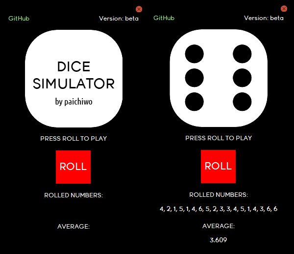

## **Dice Simulator with API (random.org) and GUI**

This is a Python program that simulates rolling a dice using API [random.org](https://random.org) and a graphical user interface (GUI) created with the PySimpleGUI library.

## Getting Started

These instructions will get you a copy of the project up and running on your local machine for development and testing purposes or just for pure fun.

## Prerequisites

To run this program, you need Python 3.x installed on your computer. 

You also need to install the following Python packages:

*   PySimpleGUI
*   requests

You can install these packages by running the following command in your command prompt or terminal:

`pip install PySimpleGUI requests`

`pip install requests`

Alternatively, run this command for automatic module installation:  

`pip install -r requirements.txt`

You will need the `Young.ttf` font (main folder) to be installed on your system for the best experience.  

After installing the required packages, you can run the program by running the **Dice\_Simulator.py** file.

## How to Play

The program uses an API provided by random.org to generate random numbers. The API requires an API key to use, which is not included in the program code. 

The program also includes a graphical user interface created using the PySimpleGUI library. The interface displays a dice image, a button to roll the dice,  the rolled numbers and the average value of the rolls.

When the user clicks the "Roll" button, the program sends a request to the random.org API to generate a random number between 1 and 6. If the API request fails, the program uses the random module to generate a random number instead.

The program then displays the corresponding image of the rolled number on the GUI, updates the rolled numbers and average value, and adds the rolled number to a list of previous rolls. If the list of previous rolls exceeds 18 rolls, the program uses scrolling that removes the oldest roll to prevent the list from growing over the edge of window boundaries.

## Customization

The program includes several variables that you can customize:

*   **images folder**: Folder that contains all the images used in the program.
*   **psg.theme**: The color theme of the GUI.  [(List of themes)](https://media.geeksforgeeks.org/wp-content/uploads/20200511200254/f19.jpg)
*   **font**: The font used in the GUI.

You can modify these variables to change the appearance of the program.

## License

This program is released under the MIT License. See the **LICENSE** file for more details.

## Examples

